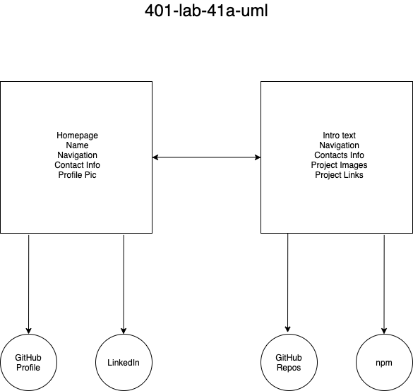

# LAB - Class 41A

## Project: Gatsby Portfolio

### Author: Simon Panek

## Gatsby Starter

[Tailwind](https://github.com/taylorbryant/gatsby-starter-tailwind)

Created by Tailor Bryant GitHub [taylorbryant](https://github.com/taylorbryant)

### Links and Resources

- [GitHub](https://github.com/simon-panek/gatsby-porfolio)

- [Netlify](gatsby-portfolio-sp.netlify.app)

### Setup

#### How to initialize/run your application (where applicable)

- `gatsby develop`

#### UML

